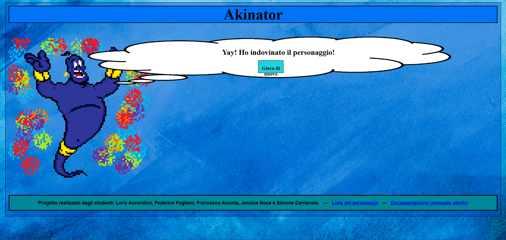

# STEAM Who
Un quiz stile Akinator circa alcuni importanti personaggi S.T.E.A.M.

<div align="center">
  
</div>

## Idea e analisi
Nel nostro progetto, ci siamo dedicati a ricreare il famoso gioco di Akinator, focalizzandoci su personaggi appartenenti alla categoria S.T.E.A.M. Per garantire un equo contributo da parte di tutti i membri del gruppo, abbiamo diviso il lavoro in quattro parti distinte.

## Suddivisione del lavoro

La prima parte riguarda il codice del gioco ed è stata sviluppata da Loris Accordino, che si è dedicato a creare la struttura logica e funzionale del nostro Akinator.

La seconda parte è stata gestita da Francesco Accolla e Simone Carnevale, che hanno lavorato insieme per definire lo stile del gioco attraverso il CSS.

La terza parte del nostro progetto è stata affidata a Jessica Noce, la quale si è occupata della ricerca e dell'inclusione dei personaggi nella categoria S.T.E.A.M.

Infine, la quarta parte riguarda l'animazione del genio Akinator e è stata curata da Federico Foglieni. L'animazione contribuirà a dare vita al nostro gioco, rendendolo più coinvolgente e divertente per gli utenti.

Questa suddivisione dei compiti ci ha consentito di lavorare in modo efficiente e produttivo, sfruttando le competenze specifiche di ciascun membro del team. Siamo fiduciosi che il risultato finale sarà un Akinator dedicato al mondo S.T.E.A.M. che appassionerà e intratterrà gli utenti.

# Ricerca generale

Per questo lavoro, ci siamo proposti di selezionare cinque personaggi per ogni categoria, affrontando un'approfondita ricerca per garantire una varietà e un interesse significativi. Durante il processo di ricerca, ci siamo concentrati su diverse informazioni chiave per arricchire l'esperienza dell'utente nel gioco.

Abbiamo colto l'opportunità di fornire dettagli che spaziano dalla data di nascita alla data di morte, qualora applicabile, permettendo così agli utenti di avere una panoramica temporale completa sulla vita dei personaggi inclusi nel gioco.

La loro professione è stata un aspetto fondamentale della nostra indagine, permettendoci di comprendere il contributo che ogni personaggio ha apportato nel campo S.T.E.A.M. Questo includeva sia le loro invenzioni specifiche che le loro scoperte, offrendo così un quadro più ampio delle loro realizzazioni.

Oltre alle informazioni biografiche e professionali, abbiamo anche considerato le caratteristiche fisiche, quando disponibili, per rendere i personaggi più riconoscibili e per consentire agli utenti di identificarli con maggiore facilità durante il gioco.

# Aspetti grafici

Per la parte di animazione dedicata al genio, abbiamo adottato uno stile di pixel art ispirato al personaggio del genio del film Aladino. Dopo un'accurata selezione del personaggio da ritrarre, ci siamo impegnati nella creazione di quattro frame distinti, ciascuno dei quali cattura espressioni diverse del genio, in sintonia con le varie situazioni che potrebbero emergere durante il gioco.

La scelta della pixel art è stata motivata da un desiderio di conferire un tocco di originalità e di evocare la nostalgia dei giochi classici, contribuendo a creare un'esperienza visiva accattivante per gli utenti. L'utilizzo di quattro frame distinti assicura una transizione fluida tra le espressioni, conferendo al genio una dinamicità che arricchisce l'interattività all'interno del nostro Akinator dedicato al mondo S.T.E.A.M.

# Funzionamento dello script
Questo script JavaScript implementa un semplice meccanismo per indovinare un personaggio famoso attraverso una serie di domande a risposta sì/no. 
Le domande sono progettate per un filtraggio progressivo, in modo da restringere gradualmente le opzioni fino a indovinare correttamente il personaggio in mente dell'utente.

## Pseudocodice generale
Di seguito è fornito un pseudocodice che rappresenta (a grandi linee) il funzionamento logico dello script:

```javascript
// ... Inizializzazione delle variabili
characters = [...];
questions = [...];
finalAnswers = {...};

// ... altre variabili

// ... callback (listener) per i pulsanti

// Funzione per passare alla prossima domanda
function nextQuestion() {
    // ...

}

// Funzione per processare la risposta dell'utente
function processAnswer(expression, answer) {
	// ... filtra i personaggi, in base alla risposta
	
	nextQuestion();
}

// Funzione per filtrare i personaggi in base alla risposta
function filterCharacters(expression, answerValue) {
	// ... filtra i personaggi, con evaluateExpression(expression, features)

}

// Funzione per valutare un'espressione
function evaluateExpression(expression, features) {
	const [feature, operator, val] = expression.split(' ');
	const featureValue = features[feature];

	// ...

	switch (operator) {
		case '<':
			return parseFloat(featureValue) < parseFloat(val);
		case '>=':
			return parseFloat(featureValue) >= parseFloat(val);
        // ...
	}

    // ...

}

// Funzione per verificare il personaggio indovinato
function askConfirmation(character) {
	// ... chiedi conferma per l'esito

}

// Esito dell'ipotesi
function resultOfTheGuess(guessed) {
	// ...

	if (guessed) {
		// ... se ha indovinato il personaggio
	}
	else {
		// ... se ha sbagliato il personaggio
	}

	// ...

}

// ... funzioni dei listener e dei pulsanti

// ...

// ...


// Funzione di avvio del gioco
function akinator() {
    // ...

    nextQuestion();
}

// Avvio del gioco al caricamento della pagina
window.onload = function() {
    // ...

    akinator();
}
```

## Strutture Dati
Nella progettazione del gioco, sono state scelte specifiche strutture dati, come gli array per personaggi e domande, per garantire un'organizzazione chiara e ottimale delle informazioni:

1. Nell'array `characters`, ogni oggetto rappresenta un personaggio famoso con attributi come nome, caratteristiche fisiche, professioni, premi, ecc. Ogni personaggio ha un insieme di attributi che include il nome, anno di nascita, paese di provenienza, genere, colore dei capelli, colore degli occhi, e altre caratteristiche specifiche.

    ```javascript
    const characters = [
        {
            name: 'Albert Einstein',
            features: {
                yearOfBirth: 1879,
                country: "Germania",
                // ... altre caratteristiche
                nobels: 1,
                yearOfDeath: 1955
            }
        },
        // ... altri personaggi
    ];
    ```

2. L'array `questions` contiene una serie di domande a risposta multipla. Ogni domanda ha un testo e una risposta associata rappresentata da un'espressione che sarà valutata durante il gioco. Le domande sono progettate per determinare le caratteristiche del personaggio a cui l'utente sta pensando.

    ```javascript
    const questions = [
        {
            question: 'Il tuo personaggio è un fisico?',
            answer: {
                expression: "professions == physicist"
            }
        },
        // ... altre domande
    ];
    ```

3. L'oggetto `finalAnswers` contiene possibili risposte che saranno mostrate all'utente a seconda che il personaggio sia stato indovinato correttamente o meno. Queste risposte vengono visualizzate alla fine del gioco in base all'esito.

    ```javascript
    const finalAnswers = {
        right: [
            "Congratulazioni! Ho indovinato il personaggio che stavi pensando.",
            // ... altre risposte, avendo indovinato il personaggio
        ],
        wrong: [
            "Mi dispiace, sembra che ci sia stato un errore nell'indovinare il personaggio.",
            // ... altre risposte, avendo sbagliato il personaggio
        ]
    };
    ```

Queste strutture dati sono utilizzate per memorizzare informazioni sui personaggi, creare domande da porre all'utente e gestire le risposte finali nel gioco, dopo aver provato a indovinare il personaggio famoso a cui l'utente sta pensando.

## Filtraggio dei Personaggi e Valutazione delle Espressioni

La funzione `processAnswer` gestisce la risposta dell'utente filtrando i personaggi rimanenti in base alla risposta data. Ecco una spiegazione delle funzioni coinvolte:

### Funzioni Principali:

1. `processAnswer(expression, answer)`: Questa funzione è chiamata quando l'utente fornisce una risposta. Prende in input l'espressione da valutare e la risposta data dall'utente. Filtra i personaggi rimanenti in base alla risposta e passa alla prossima domanda.

    ```javascript
    function processAnswer(expression, answer) {
        remainingCharacters = filterCharacters(expression, answer);
        nextQuestion();
    }
    ```

2. `filterCharacters(expression, answerValue)`: Questa funzione si occupa di filtrare i personaggi in base alla risposta fornita. Utilizza la funzione `evaluateExpression` per valutare l'espressione e confrontare i valori delle caratteristiche dei personaggi con la risposta data.

    ```javascript
    function filterCharacters(expression, answerValue) {
        return remainingCharacters.filter(character => {
            return evaluateExpression(expression, character.features) == answerValue;
        });
    }
    ```

3. `evaluateExpression(expression, features)`: Questa funzione valuta un'espressione che contiene un'operazione condizionale. Prende in input un'espressione, estrae l'operatore e i valori necessari dall'espressione e valuta se l'espressione è vera o falsa in base alle caratteristiche del personaggio. Utilizza un set di operatori come `<`, `>`, `<=`, `>=`, `!=` e `==` per confrontare i valori delle caratteristiche del personaggio con il valore fornito.

    ```javascript
    function evaluateExpression(expression, features) {
        // ... (codice della funzione)
    }
    ```

In breve, `processAnswer` richiama `filterCharacters` per filtrare i personaggi in base alla risposta dell'utente utilizzando la funzione `evaluateExpression`, che confronta le caratteristiche del personaggio con l'espressione data dall'utente. Infine, la funzione `nextQuestion` viene chiamata per procedere con la prossima domanda nel gioco.

## Gestione degli Eventi e dei Listener

Nel gioco, la gestione degli eventi e dei listener è fondamentale per catturare le azioni dell'utente attraverso l'interfaccia dei pulsanti. Ecco come è stata gestita questa logica nel codice:

### Funzioni Coinvolte:

1. `updateListenerSafe(element, event, oldCallback, newCallback)`: Questa funzione è stata progettata per aggiornare i listener degli eventi sugli elementi HTML. Essa rimuove il vecchio callback (se presente e di tipo funzione) e aggiunge il nuovo callback all'evento specificato sull'elemento fornito.

    ```javascript
    function updateListenerSafe(element, event, oldCallback, newCallback) {
        if (element && oldCallback && typeof oldCallback === 'function') {
            element.removeEventListener(event, oldCallback);
        }
        
        if (element && newCallback && typeof newCallback === 'function') {
            element.addEventListener(event, newCallback);
        }

        return newCallback;
    }
    ```

2. `setButtonListeners(yesBtnListener, noBtnListener, resetBtnListener)`: Questa funzione imposta i listener dei pulsanti "Sì", "No" e "Reset" richiamando `updateListenerSafe`. Assegna i nuovi listener ai rispettivi pulsanti in base alle funzioni passate come argomenti.

    ```javascript
    function setButtonListeners(yesBtnListener, noBtnListener, resetBtnListener) {
        handleYesAnswer = updateListenerSafe(yesButton, 'click', handleYesAnswer, yesBtnListener);
        handleNoAnswer = updateListenerSafe(noButton, 'click', handleNoAnswer, noBtnListener);
        handleResetAnswer = updateListenerSafe(resetButton, 'click', handleResetAnswer, resetBtnListener);
    }
    ```

3. Assegnamento dei listener ai pulsanti: Nel gioco, l'assegnamento dei listener ai pulsanti avviene utilizzando `setButtonListeners`. Ad esempio:

    ```javascript
    setButtonListeners(function() { resultOfTheGuess(true) }, function() { resultOfTheGuess(false) }, null);
    ```

    Questo snippet assegna i listener ai pulsanti "Sì" e "No" in modo che quando vengono cliccati, chiamino la funzione `resultOfTheGuess(true)` e `resultOfTheGuess(false)` rispettivamente.

In sintesi, le funzioni `updateListenerSafe` e `setButtonListeners` sono state utilizzate per gestire la rimozione e l'aggiunta sicura dei listener sugli elementi HTML, consentendo il controllo delle azioni dell'utente all'interno del gioco.

## Istruzioni per l'Utilizzo

1. Avvia il gioco.
2. Rispondi alle domande con sì o no.
3. Continua a rispondere fino a quando il personaggio non viene indovinato.

### Note Importanti:

- Assicurati di rispondere con attenzione e coerenza. Risposte casuali o inesatte potrebbero compromettere la correttezza dell'esito.
- Se le risposte fornite non sono chiare o imprecise, il gioco potrebbe non essere in grado di indovinare correttamente il personaggio desiderato.
- In caso di errore nelle risposte o di mancato indovinamento del personaggio, il gioco ricomincerà, permettendo di giocare una nuova partita.

Divertiti a giocare e buona fortuna nel far indovinare al gioco il personaggio che hai scelto!
